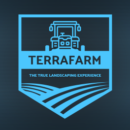
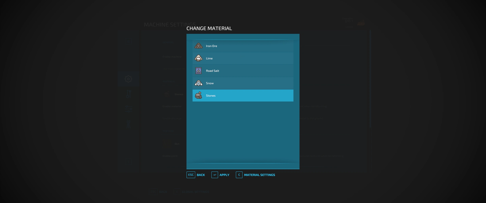
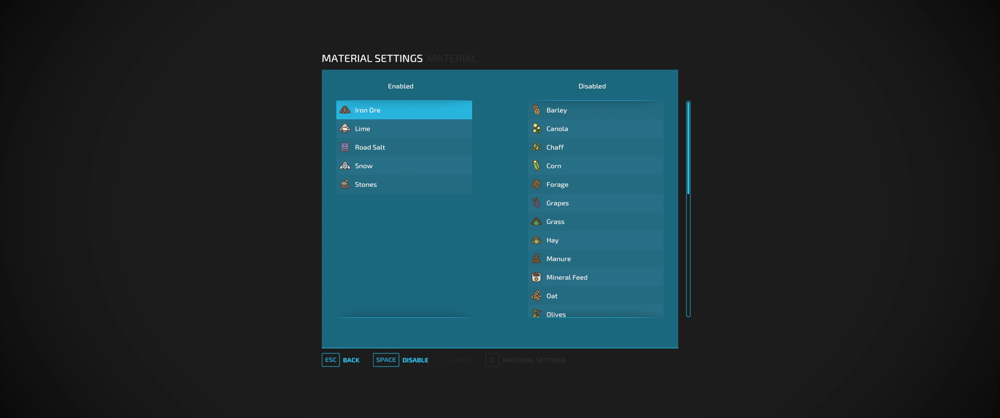
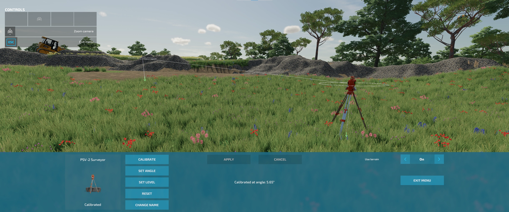

# TerraFarm 0.9 BETA

Beta version of TerraFarm. Please report bugs [here](https://github.com/scfmod/FS22_TerraFarm/issues/).

```
author: scfmod
url:    https://github.com/scfmod/FS22_TerraFarm

If you distribute this mod, always include this info.

AND DO NOT UPLOAD IT TO MONETARY UPLOAD SERVICES.
THIS CODE IS AVAILABLE TO ANYONE FOR FREE AND YOU CAN USE
IT TO LEARN, FORK AND SPREAD THE KNOWLEDGE.
```

## Table of Content

- [What's new](#whats-new)
- [Multiplayer](#multiplayer)
- [Materials](#materials)
- [Supported equipment](#supported-equipment)
  - [Base game](#base-game)
  - [Platinum expansion](#platinum-expansion)
  - [Premium expansion](#premium-expansion)
- [Surveyor](#surveyor)
- [How to download and install](#how-to-download-and-install)
- [Documentation](#creating-machine-configurations)
- [How to report bugs](#how-to-report-bugs)
- [FAQ](#faq)
- [Known issues](#known-issues)
- [Translations](#translations)
- [Credits](#credits)

## What's new

- Completely rewritten code
- Improved landscaping behaviour
- Improved performance
- Grade terrain with calibration from surveyor equipment
- Support for multiple active machines (main vehicle + attachments)
- Full multiplayer support
  - Synchronized machine settings
  - Improved network performance
  - All machine operations are run server side
  - Permissions based
- New UI
- New HUD
- Vehicle specialization for modders
- Supports external machine configurations
- Machine settings are now saved
- Much simpler configuration setup for modders

and more.

## Multiplayer

Multiplayer is fully supported. In order to use machines, players will need to have either landscaping permission, be farm manager or granted admin access.
Farm managers can disable/enable machines owned by the farm, and admins can control global settings.

## Materials

All materials available on map, including mods adding filltypes, will be available for players to use.
There is also a material settings dialog where you can control which materials players can select (SP and MP).




## Supported equipment

TerraFarm integrates support for base game, platinum expansion and premium expansion equipment.

TerraFarm now supports vehicle specialization for modders to integrate configuration(s) directly into their mods. In order to provide support for 3rd. party equipment during this transition I have created a mod which adds configurations for some various mods: [TerraFarm - Machines Addon](https://github.com/scfmod/FS22_TerraFarmMachines). The number of supported mods are limited as I myself don't have time to setup configuration for every mod, but creating configurations now are much simpler than older versions.

Long story short; there's no longer needed for modders to edit TerraFarm to add support for equipment.

### Base game
```
- Albutt front loader bucket
- Düvelsdorf MSS 3000 leveler
- Düvelsdorf MSS 3700 leveler
- Holaras MES 400 leveler
- Holaras MES 500 leveler
- Magsi telehandler bucket
- Magsi wheel loader bucket
- mcCormack overtipping bucket
- Paladin high dump bucket
```

### Platinum expansion
```
- Volvo L120H general purpose bucket
- Volvo L120H high tip bucket
- Volvo L120H rock bucket
- Volvo L180H general purpose bucket
- Volvo L180H high tip bucket
- Volvo L180H rock bucket
- Volvo LM841 general purpose bucket
- Volvo LM841 rock bucket
```

### Premium expansion
```
- WIFO HOD-V-275 front loader bucket
```

## Surveyor

A new feature in TerraFarm is the option to use surveyor equipment to calibrate your machine(s). This allows you to level at a specific height or grade at a certain angle following the calibrated line.



If you want to create your own surveyor equipment, read more [here](./docs/SURVEYOR.md).

## How to download and install

Download the latest [```FS22_0_TerraFarm.zip```](https://github.com/scfmod/FS22_TerraFarm/releases/latest/download/FS22_0_TerraFarm.zip) and copy/move it into your FS22 mods folder.

## Documentation

For implementing vehicle configurations and creating configuration mods see [``INDEX.md``](/docs/INDEX.md)

## Map resources extension

Feature for map makers to define areas on map with resources. When a compatible map is loaded an extra option will be enabled in TerraFarm global settings dialog.

For more information on integrating into map see [``MAP_RESOURCES.md``](/docs/MAP_RESOURCES.md)

## How to report bugs

Before reporting a bug please do the following:
- Make sure there aren't any issues previously filed for the same bug.
- Disable all other mods to make sure it's not a conflict/another mod causing the issue.
- Be able to reproduce the bug.
- If it's not a map specific bug, please use one of the base game maps.

Create a new issue on [this page](https://github.com/scfmod/FS22_TerraFarm/issues/).
If applicable, attach log.txt or use https://pastebin.com and include the link in the issue.
In the text please describe what the bug is and how to reproduce it.

**NOTE: A (huge) log.txt filled with unrelated warnings/errors from other mods will be rejected.**

## FAQ

#### Console support (XBOX/PS)?
No, script mods are not available on consoles.

#### Does this mod add any filltypes?
No.

#### Can I use configurations from older versions?
No, but the process of creating configurations are now much easier.

#### Is TerraFarm coming to FS25?
Yes, work on FS25 version will start when FS25 is released.

## Known issues

On client side in multiplayer tire tracks doesn't disappear when terraforming the landscape.
This is because the game does not sync tire tracks in multiplayer. I may be able to fix this in a later version, but for now this is a very low prioritized visual bug.

## Translations

If anyone is interested in adding more translations to the mod, [create a new issue](https://github.com/scfmod/FS22_TerraFarm/issues/) with translation file(s) and I will add them :-)

## Credits

Huge thanks to PeteyJ for creating the PSV2 Surveyor shipped with this mod.

Also a big thanks to the fellow modders from **Jeremy Brown Modeling and Simulation** and **WZL Modding** discord servers for all the testing and feedback.

[](https://github.com/open-modding-alliance)

Also be sure to follow and support the [Open Modding Alliance](https://github.com/open-modding-alliance) if you're a modder or interested in creating mods for FS22/FS25.
