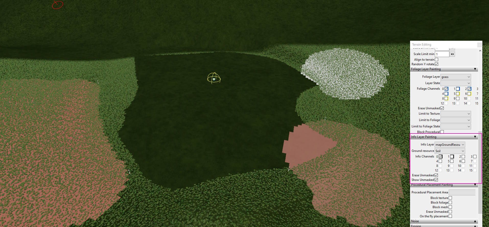

# Map resources

Map resources feature available for mappers to designate areas on map with specific fillTypes to be mined when option is enabled in TerraFarm mod.

## Map I3D

```xml
<InfoLayer name="mapGroundResources" ...>
    <Group name="Ground resources" firstChannel="..." numChannels="...">
        <Option value="0" name="None" />
        <Option value="1" name="Soil" />
        <Option value="2" name="Stone" />
    </Group>
</InfoLayer>
```

[Example file](./mapResources.i3d.xml)

## XML configuration

```mapGroundResources.xml```

This file must be located in same folder as your map .xml file.

```xml
<groundResources infoLayer="mapGroundResources">
    <layers>
        <layer value="0" fillType="STONE" paintLayer="GRAVEL" />
        <layer value="1" fillType="DIRT" paintLayer="dirt" paintLayerDischarge="dirtDark" />
        <layer value="2" fillType="STONE" paintLayer="rock" yield="0.8" />
        ...
    </layers>
</groundResources>
```

[Example file](./mapResources.xml)

```groundResources```

| Name | Type | Required | Default | Description |
|------|------|----------|---------|-------------|
| infoLayer | string | No | ```mapGroundResources``` | Name of InfoLayer from map .i3d |

```groundResources.layers(?).layer```

| Name | Type | Required | Default | Description |
|------|------|----------|---------|-------------|
| value | integer | Yes | | Bit value from map .i3d InfoLayer Option |
| fillType | string | Yes | | Name of filltype to be used when terraforming (case-sensitive) |
| paintLayer | string | Yes | | Name of paint layer (case-sensitive) when terraforming |
| paintLayerDisharge | string | No | paintLayer | Name of paint layer (case-sensitive) when disharging to ground |
| yield | float | No | ```1.0``` | Specify yield of terraforming ground to material |

## Editor

